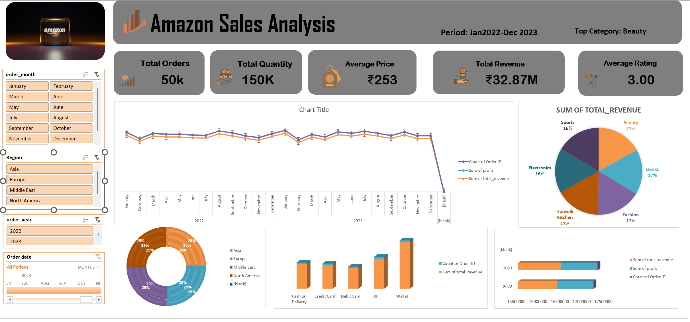

# 🛒 Amazon Sales Intelligence Dashboard
### Excel · Pivot Tables · Slicers · Data Analytics



> **An end-to-end sales analytics project built entirely in Microsoft Excel — featuring an interactive dashboard, 5 pivot tables, 6 dynamic charts, and functional slicers across 50,000 real-world Amazon orders.**

---

## 📌 Project Overview

This project simulates the work of a **data analyst at an e-commerce company**, analysing 2 years of Amazon sales data (Jan 2022 – Dec 2023) to uncover revenue trends, category performance, regional patterns, and discount strategy effectiveness.

| Metric | Value |
|--------|-------|
| 📦 Total Orders | 50,000 |
| 💰 Total Revenue | ₹32.87M |
| 📈 Net Profit | ₹1.64M |
| ⭐ Avg Customer Rating | 2.99 / 5 |
| 🏷 Avg Discount | ~12% |
| 📅 Period | Jan 2022 – Dec 2023 |

---

## 🎯 Business Objectives

| # | Objective | Key Question |
|---|-----------|--------------|
| 1 | **Revenue Analysis** | Which categories & regions drive the most revenue? |
| 2 | **Profitability** | Where is margin highest? Does discounting hurt profit? |
| 3 | **Sales Trends** | How does performance shift month-over-month / YoY? |
| 4 | **Customer Behaviour** | What payment methods do customers prefer? |
| 5 | **Discount Strategy** | Does higher discount actually increase order volume? |
| 6 | **Satisfaction Insights** | Which categories have the best ratings? |

---

## 📂 File Structure

```
Amazon_Sales_Dashboard_FINAL.xlsx
│
├── 🛒 Dashboard          ← Main interactive dashboard (START HERE)
├── 📊 Pivot Tables       ← 5 analysis pivot tables with styling
├── 📋 Raw Data           ← 50,000 rows of cleaned order data
└── ChartData             ← Hidden sheet powering all 6 charts
```

---

## 📊 Dashboard Components

### KPI Cards (Top Row)
- 💰 **Total Revenue** — ₹32.87M across all categories
- 📈 **Net Profit** — ₹1.64M | Margin 5.0%
- 📦 **Total Orders** — 50K (25K per year)
- 📊 **Qty Sold** — 149K units across 6 categories
- ⭐ **Avg Rating** — 2.99/5 | Avg Price ₹253

### Charts
| Chart | Type | Insight |
|-------|------|---------|
| Monthly Revenue Trend | Dual Line | 2022 vs 2023 YoY comparison |
| Revenue by Region | Pie Chart | % share per geography |
| Category Performance | Clustered Bar | Revenue vs Profit by category |
| Discount Impact | Column Chart | How discount % affects revenue |
| Payment Method Revenue | Horizontal Bar | Which payment drives most sales |
| Category Avg Rating | Horizontal Bar | Customer satisfaction by category |

### Pivot Tables
1. 📦 **Category Performance** — Revenue, Profit, Orders, Qty, Avg Rating
2. 🌍 **Regional Performance** — Revenue, Profit, Orders by region
3. 💳 **Payment Method Breakdown** — Revenue per payment type
4. 📅 **Yearly Summary** — 2022 vs 2023 head-to-head
5. 🏷 **Discount Impact** — Revenue & orders by discount tier

---

## 🔪 How to Use Slicers (Interactive Filters)

> Slicers let you filter the **entire dashboard** with one click

1. Open the file in **Microsoft Excel** (not Google Sheets)
2. Click inside any Pivot Table on the `📊 Pivot Tables` sheet
3. Go to: **PivotTable Analyze → Insert Slicer**
4. Select: `Product category`, `Region`, `Payment method`, `order_year`
5. **Right-click each slicer → Report Connections → tick all pivot tables**
6. Move slicers to the Dashboard sheet for a clean layout

---

## 🧰 Tools & Skills Used


- **Microsoft Excel** — Dashboard design, formatting, charts
- **Pivot Tables** — Multi-dimensional data summarisation
- **Excel Slicers** — Dynamic cross-filtering across all visuals
- **Data Cleaning** — Handled nulls, date parsing, type normalisation
- **Data Analysis** — Trend analysis, YoY comparison, category benchmarking

---

## 📈 Key Insights

- 🏆 **Beauty** leads in quantity sold (25.4K units); **Fashion** leads in revenue (₹5.54M)
- 🌍 **Middle East** is the top revenue region at ₹8.3M
- 💳 **Wallet** generates the highest revenue among payment methods
- 📉 Revenue drops ~16% as discount increases from 0% → 30% — **discounting hurts profitability**
- 📅 Revenue is **relatively stable month-to-month** with slight peaks in Jan & Aug
- ⚠️ Avg rating of **2.99/5 is a red flag** — customer satisfaction needs attention

---

## 🚀 How to Run / Open

1. Download `Amazon_Sales_Dashboard_FINAL.xlsx`
2. Open in **Microsoft Excel 2016 or later**
3. Navigate to the **🛒 Dashboard** tab
4. Enable editing if prompted
5. Use slicers on the left panel to filter interactively

> ⚠️ Note: Slicers require Excel desktop app. Google Sheets does not support slicers.

---

## 📁 Dataset

- **Source:** Simulated Amazon sales dataset (publicly available for learning purposes)
- **Rows:** 50,000 order records
- **Columns:** Order ID, Date, Category, Price, Discount%, Qty, Region, Payment, Rating, Revenue, Profit

---

## 🙋 About This Project

This is my **first end-to-end data analytics project**, built to demonstrate practical Excel skills in a real-world business context. The project covers the full analyst workflow: data cleaning → aggregation → pivot analysis → dashboard visualisation → business insight generation.

**Connect with me:**
- 🔗 LinkedIn: https://www.linkedin.com/in/sjunaidx/
- 💻 GitHub: https://github.com/sjunaidx

---

## 📜 License

This project is open for learning and portfolio purposes. Dataset is synthetic/simulated.

---

⭐ **If you found this useful, please star the repo!**
